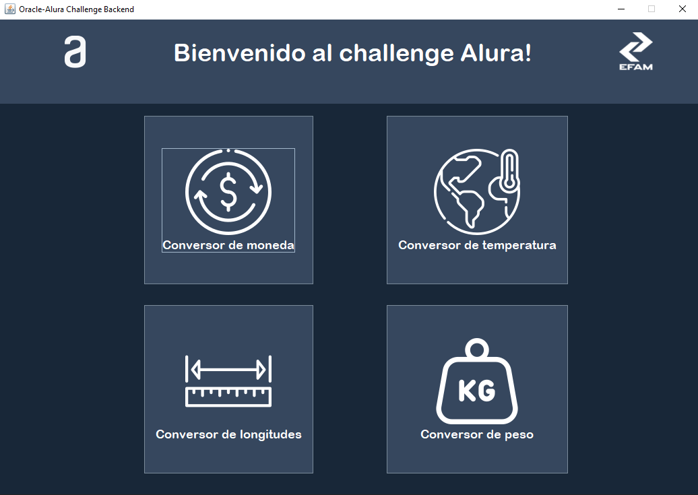
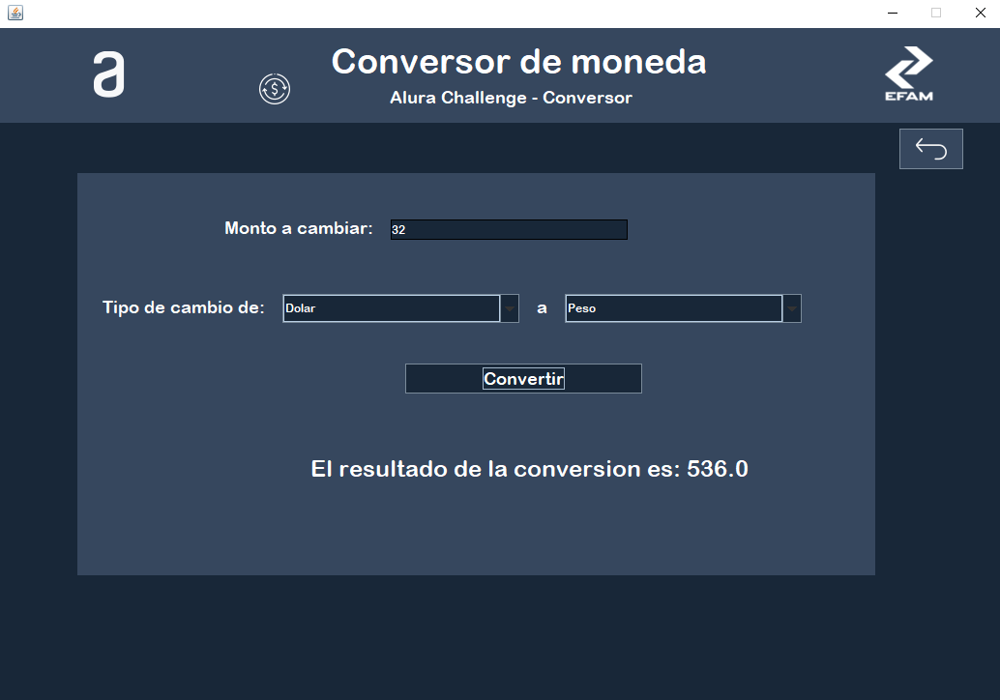
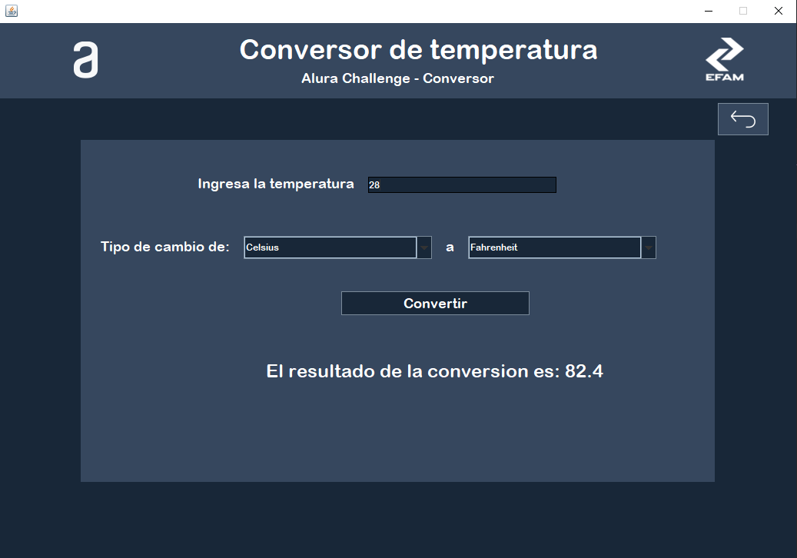
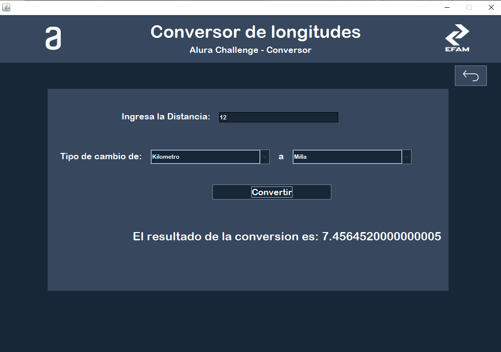
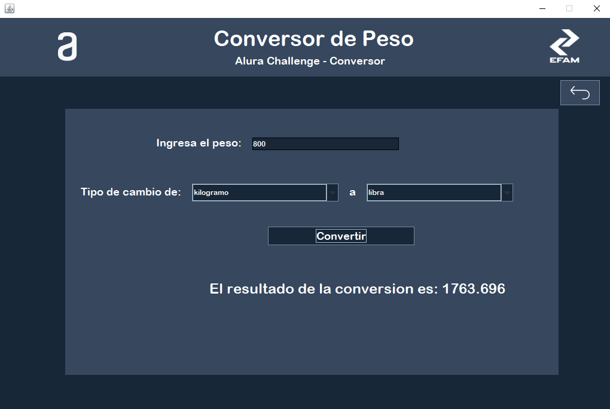
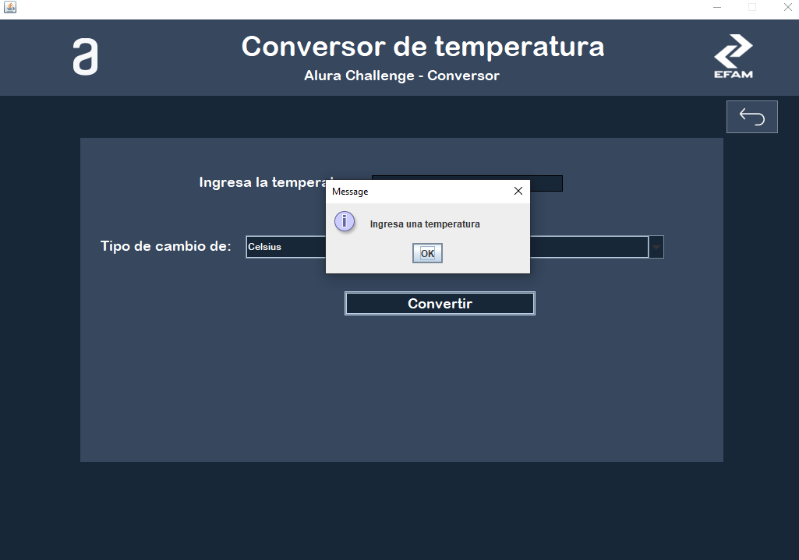

## ChallengeBackendAluraOne - Conversor de Monedas, Temperatura, Logitudes y Peso.
¡Bienvenido al primer desafío del Challenge Java!

En esta oportunidad Alura Latam junto con Oracle en su plan de desarrollo Next Education, a los Devs se nos solicitó crear un conversor de divisas utilizando el lenguaje Java.

## Challenge 1 Backend 👋
**Este Challenge consiste en crear una aplicación desarrollada en Java utilizando JavaSwing la cual permitira realizar conversiones entre diferentes tipos de monedas, temperatura, longitudes y peso.**
 

 ## Caracteristicas del programa
 La aplicacion cuenta con vistas amigables e intuitivas que nos ayudan a realizar conversion entre diferentes tipos de unidades 
 **Conversor de Moneda:**
 El usuario ingresará un monto el cual le permitirá seleccionar una moneda de origen las cuales pueden ser entre (`peso`, `dolar`, `euro`, `libra`, `yenes`)y una moneda de destino para realizar la conversion.
 
 **Conversor de temperatura**
El usuario ingresará una temperatura la cual le permitirá seleccionar una escala de origen las cuales pueden ser entre (`Celsius`, `fahrenheit`, `kelvin`)y una  de destino para realizar la conversion.

**Conversor de Longitud**
El usuario ingresará una Longitud la cual le permitirá seleccionar una unidad de origen las cuales pueden ser entre (`centimetros`, `millas`, `kilometros`, `metros`, `pies`)y una  de destino para realizar la conversion.

**Conversor de Peso**
El usuario ingresará un peso la cual le permitirá seleccionar una unidad de origen las cuales pueden ser entre (`kilogramo`,  `gramo`, `libra`, `tonelada`)y una  de destino para realizar la conversion.

## Validaciones
La aplicacion cuenta con validaciones(Excepciones) para manejar los casos y proporcionar una alerta al usuario, para evitar la introduccion de valores que no sean validos y campos vacios

## Autor
*"Erick Francisco Alvarez Mora"*
